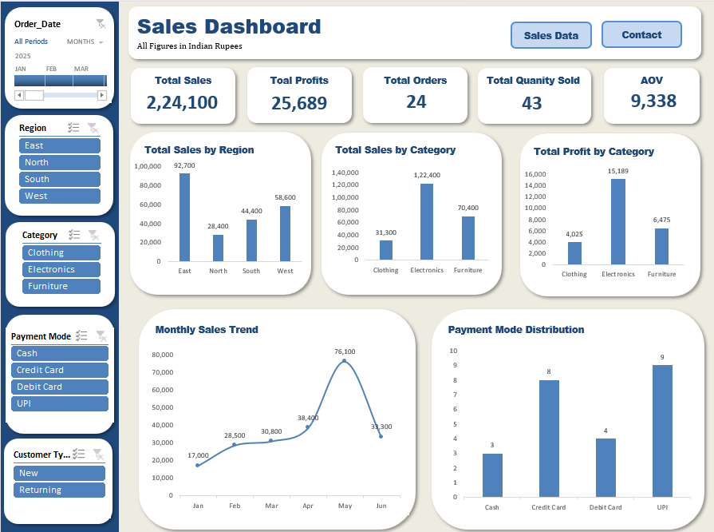

# Sales Dashboard using Excel

## Project Overview

This project is an interactive **Sales Dashboard built in Microsoft Excel** using a sample sales dataset.

The goal of this project was to practice analyzing sales data and presenting key business metrics and insights through an interactive dashboard.

## Tools & Skills

* Microsoft Excel
* PivotTables
* PivotCharts
* Slicers
* Excel formulas
* Data aggregation
* Dashboard design
* Business insights

## Dashboard Features

The dashboard includes:

* **Total Sales**
* **Total Profit**
* **Average Order Value (AOV)**
* **Monthly Sales Analysis**
* **Payment Mode Distribution**
* **Region-wise Sales Analysis**
* **Interactive Region Slicer**
* Interactive charts and KPI cards

The region slicer allows users to filter the dashboard and view the corresponding changes in the KPIs and charts.

## Key Insights

* The **East region** generated the highest sales, contributing **41.37%** of total sales, while the **North region** had the lowest contribution at **12.67%**.
* **Electronics** generated the highest sales, contributing **54.62%** of total sales, and also contributed the highest share of total profit at **59.12%**.
* **UPI** was the most commonly used payment mode, accounting for **37.50%** of total orders, while **Cash** accounted for **12.50%**.
* **May** recorded the highest monthly sales of **₹76,100**, contributing **33.96%** of total sales, while **January** had the lowest sales at **₹17,000**, contributing **7.59%**.

## Dashboard Preview

## Project Files

* `Sales_Dashboard_Excel.xlsx` — Complete Excel workbook containing the dashboard, raw data, supporting PivotTables, and business insights.
* `Dashboard_screenshot.png` — Preview of the completed dashboard.

## Learning Outcome

Through this project, I practiced transforming raw sales data into an interactive Excel dashboard using PivotTables, PivotCharts, slicers, and KPI metrics.

The project also helped me practice identifying and communicating business insights from sales data.

## Dataset

Sample sales data created for Excel dashboard practice.
